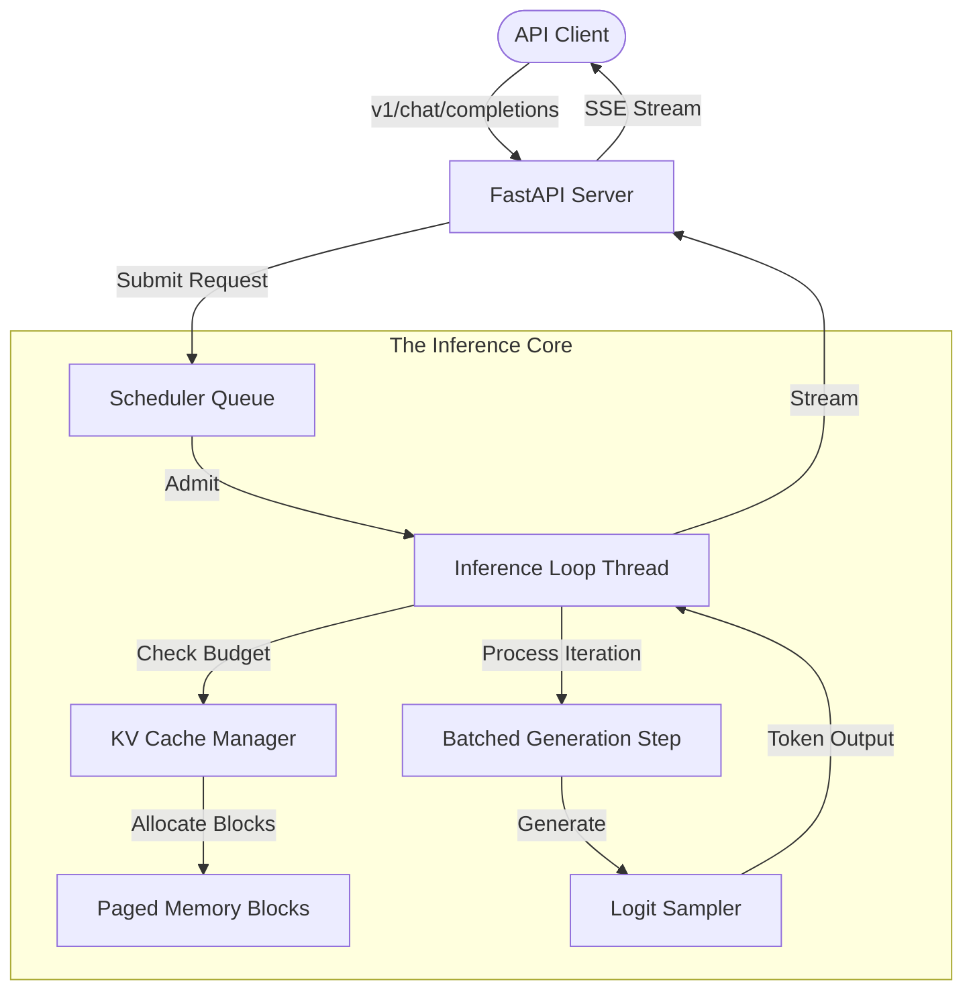

# wLLM — The Windows Native Inference Engine

<p align="center">
  
  
  
  
  
</p>

## The Vision
wLLM is a **100% ground-up, high-performance inference engine** specifically architected for the Windows ecosystem. Built in pure Python and PyTorch, it delivers server-grade continuous batching and KV-paging capabilities to consumer hardware without the Linux-dependency overhead of vLLM.

> [!IMPORTANT]
> **This is NOT a fork.** wLLM is an independent implementation designed to bridge the gap between high-level research (HuggingFace) and low-level system performance on Windows.

---

## Performance Matrix: Hardware-Agnostic Adaptation
wLLM uses a dynamic profiling engine to mathematically tune its performance based on your exact hardware signature. No static profiles, just raw math.

| Hardware Class | VRAM Headroom | Max Batch Size | Context Window | Optimizations |
| :--- | :---: | :---: | :---: | :--- |
| **Mobile / Entry-Level** | < 12 GB | 1 – 4 | 2,048 | 4-bit NF4 + SDPA |
| **Prosumer Desktop** | 12 – 24 GB | 5 – 12 | 4,096 | Mixed Precision + SDPA |
| **Enthusiast (RTX 4090)** | 24 GB+ | 12 – 32 | 8,192+ | FlashAttention-2 + AWQ |
Profiles can also be customised using commands.
---

## Architectural Flow: Continuous Batching Engine
Unlike standard sequential servers, wLLM treats the GPU as a shared resource that accepts new requests into the batch at every token iteration.



---

## Why Developers Choose wLLM
1. **Zero-Day Architecture Support**: Any AutoModelForCausalLM on HuggingFace works instantly. No waiting for community GGUF conversions.
2. **Infinitely Extensible**: 100% Python. Modify scheduling logic, integrate custom logit processors, or add backends without touching a C++ compiler.
3. **Optimized Speculative Decoding**: Integrated draft models accelerate inference by predicting multiple tokens per target forward pass.
4. **Multi-Backend Choice**: Native support for **PyTorch**, **ONNX Runtime (via Optimum)**, and **DirectML**.

---

## Rapid Deployment

### Modern Installation (Recommended)
The `install.ps1` script (or `install.bat` wrapper) handles everything: **Python 3.12 bootstrapping**, virtual environment creation, CUDA-specific PyTorch wheels, and PATH configuration. No pre-installed Python required.

```powershell
# Run the installer directly
powershell -ExecutionPolicy Bypass -File .\install.ps1
```

### Manual Configuration
**Environment (uv - Recommended):**
```bash
uv venv .venv --python 3.12
.venv\Scripts\activate
uv pip install torch torchvision torchaudio --index-url https://download.pytorch.org/whl/cu124
uv pip install -e . --extra-index-url https://download.pytorch.org/whl/cu124
```

**Environment (standard pip):**
```bash
python -m venv .venv
.venv\Scripts\activate
pip install torch torchvision torchaudio --index-url https://download.pytorch.org/whl/cu124
pip install -e . --extra-index-url https://download.pytorch.org/whl/cu124
```

---

## Interface Reference

**Interactive Chat:**
```bash
winllm chat --model "microsoft/Phi-3-mini-4k-instruct" --quantization 4bit
```

**API Server Deployment:**
```bash
winllm serve --model "microsoft/Phi-3-mini-4k-instruct" --quantization 4bit --port 8000
```

---

## Technical Deep Dives
Dive into the engineering principles behind the engine:
- [Architecture Details](documentation/Architecture.md) — Visual guide to internal workflows.
- [Genesys Deep Dive](documentation/Genesys.md) — From-first-principles inference guide.
- [Walkthrough](documentation/WALKTHROUGH.md) — End-to-end user guide.
- [Changelog](documentation/CHANGELOG.md) — Evolution of the engine.

---

## License
MIT — wLLM is, and will always be, free and open source.
