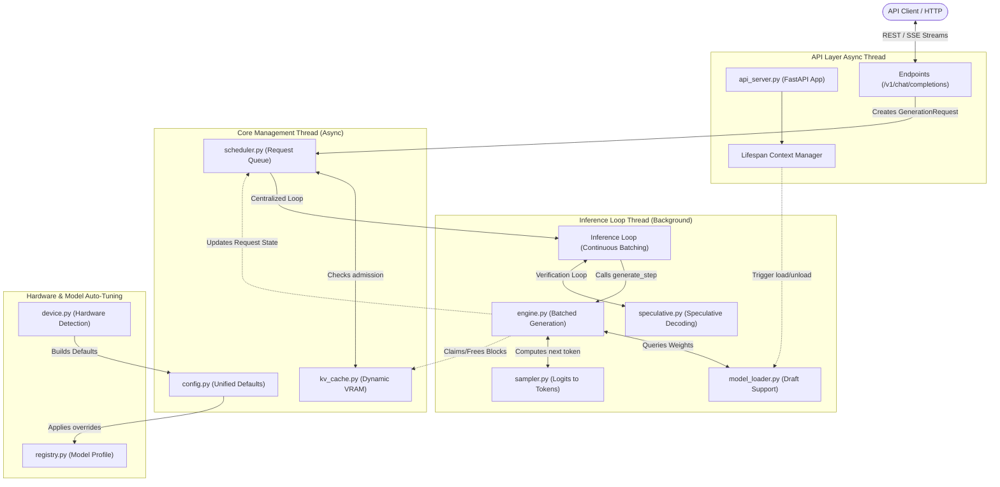
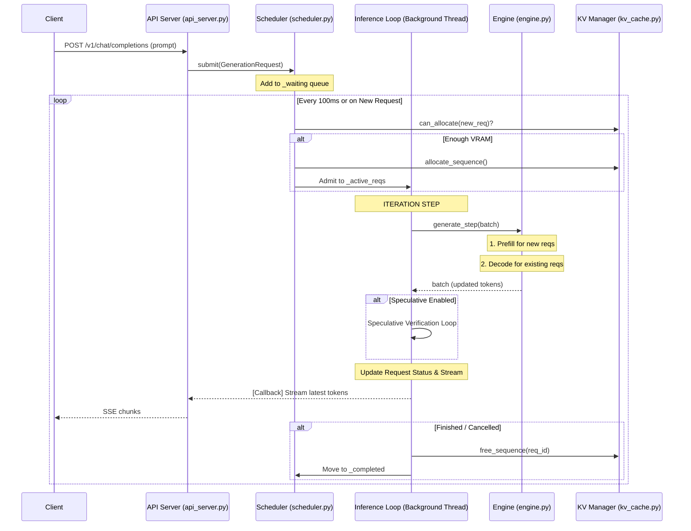
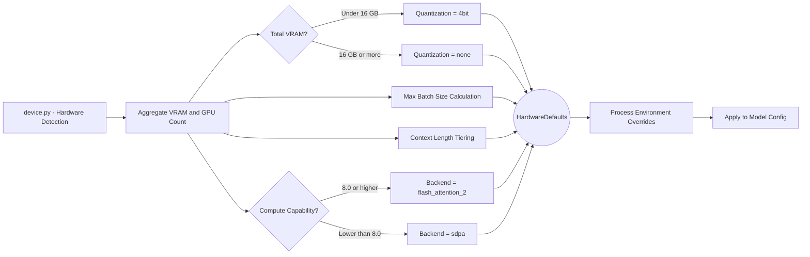
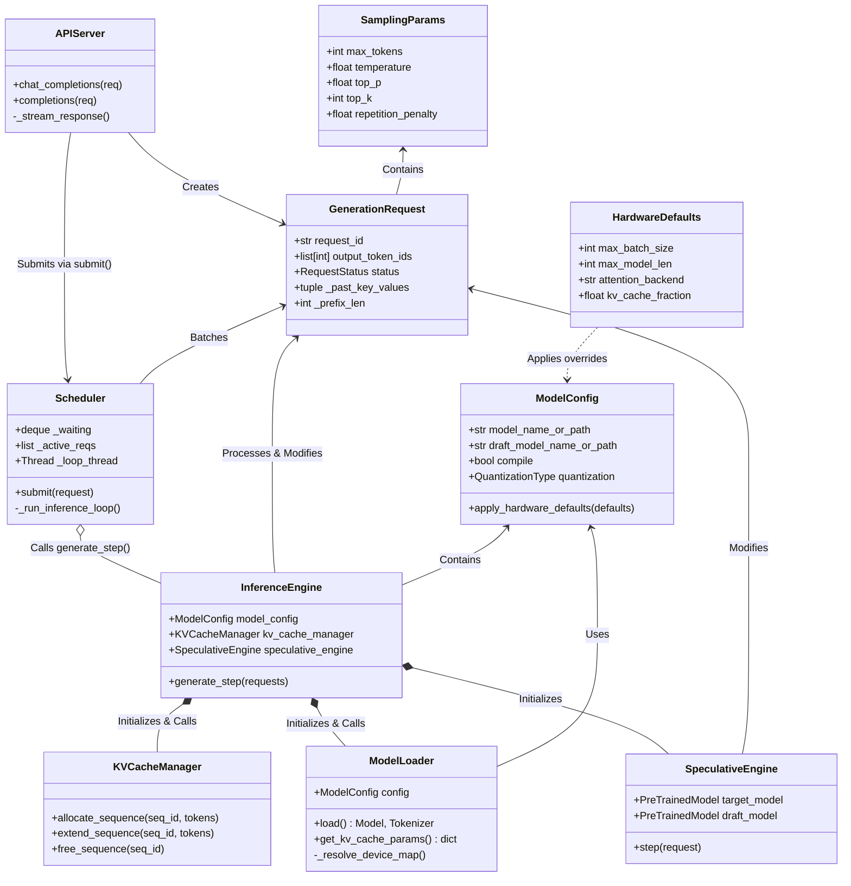

# wLLM Architecture & Design

This document provides a comprehensive, visual guide to the software architecture, design patterns, and internal workflows of the WinLLM inference engine. It is designed to help contributors quickly understand how the system is organized, how data flows through the engine, and how memory is managed.

> [!NOTE] Table of Contents
> - [1. High-Level System Architecture](#1-high-level-system-architecture)
> - [2. The Request Lifecycle Flow](#2-the-request-lifecycle-flow)
> - [3. Dynamic Memory & Hardware Management](#3-dynamic-memory--hardware-management)
> - [4. Class & Data Flow Diagram](#4-class--data-flow-diagram)
> - [5. Component Deep Dive](#5-component-deep-dive)

---

## 1. High-Level System Architecture

At its core, WinLLM is divided into three main layers: the API Layer (FastAPI), the Core Engine (Request Scheduling & Memory Management), and the Inference Engine (PyTorch Generation Loop).

---

## 2. The Request Lifecycle Flow

When a user submits a prompt, it travels exactly through this pipeline:

---

## 3. Dynamic Memory & Hardware Management

WinLLM handles memory entirely mathematically at runtime, rather than relying on hardcoded rules.

### Hardware Detection Pipeline

### The Paged Attention (KV Cache) Simulator

Because pure PyTorch doesn't natively support memory paging like vLLM does, `kv_cache.py` simulates block-level allocation. When the scheduler receives a request, the `KVCacheManager`:

1. Uses actual model parameters (`num_layers`, `num_kv_heads`, `head_dim`) to compute precise token byte costs.
2. Checks remaining available system VRAM via `_get_total_available_vram()`.
3. Pre-allocates a percentage (default 90%) into logical blocks of 16 tokens.
4. Tells the scheduler if there is enough block space to fit the incoming prompt + generation.

---

## 4. Class & Data Flow Diagram

This diagram illustrates how core classes interact, and how data structures (like configs and requests) are passed throughout the system.

---

## 5. Component Deep Dive

### [`api_server.py`](../winllm/api_server.py) | The Gateway
- Emulates standard OpenAI REST API.
- Implements FastAPI's modern `@asynccontextmanager` `lifespan` hook. The model is loaded onto the GPU during startup, and gracefully unloaded during shutdown (Ctrl+C).
- Handles streaming by acting as an asynchronous bridge to the synchronous PyTorch loops. Uses `asyncio.Queue` and `loop.call_soon_threadsafe()`.
- Catches GPU timeouts and injects JSON-formatted error chunks securely into the SSE stream.

### [`scheduler.py`](../winllm/scheduler.py) | The Task Orchestrator
- **Continuous Batching**: No longer uses a semaphore for simple concurrency. Instead, it maintains a background `_loop_thread` that constantly attempts to admit new requests into an active batch based on KV cache availability.
- **Async Interface**: Provides `submit()` and `submit_streaming()` as async interfaces, while the actual heavy lifting happens in the background thread via the `InferenceLoop`.

### [`engine.py`](../winllm/engine.py) | The Batched Inference Engine
- **`generate_step()`**: The primary entry point for inference. It takes a *list* of requests and performs one iteration of prefill or decode for all of them.
- **Integrated `torch.compile`**: Supports compiling the forward pass into optimized kernels, significantly improving throughput by reducing Python overhead in the decode iterations.

### [`speculative.py`](../winllm/speculative.py) | Accelerated Generation
- **Draft Model Logic**: Implements speculative decoding where a smaller model proposes tokens that the larger target model verifies in a single forward pass.
- **Acceptance Loop**: Dynamically adjusts the target model's KV cache and output tokens based on how many "draft" tokens were correct.

### [`kv_cache.py`](../winllm/kv_cache.py) | Logical Memory Tracker
- **Iteration-Level Allocation**: Tracks block usage across the entire batch.
- **Sequence Management**: Provides `allocate_sequence`, `extend_sequence`, and `free_sequence` methods invoked by the scheduler and engine during the generation lifecycle.

### [`cli.py`](../winllm/cli.py) & [`config.py`](../winllm/config.py) | Unified Configurations
- Centralizes Dataclasses (`ModelConfig`, `SchedulerConfig`, `KVCacheConfig`, `SamplingParams`).
- CLI params naturally cascade into Config objects. The `--auto-config` flag triggers the dynamic hardware discovery sequence, overwriting baseline constraints with optimized formulas.

### [`registry.py`](../winllm/registry.py) | Model Introspection
- Examines the HuggingFace repo name (e.g. `meta-llama/Llama-3.1-8B-Instruct`).
- Determines the architectural family (Llama, Gemma, Mistral, Qwen).
- Injects ideal hyper-parameters (e.g. `max_context_window=32768`, `rope_scaling=True`) before the tensors are ever initialized in VRAM.
