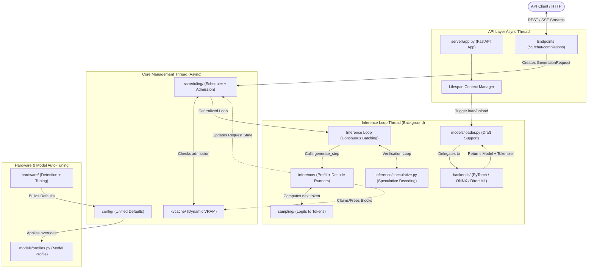
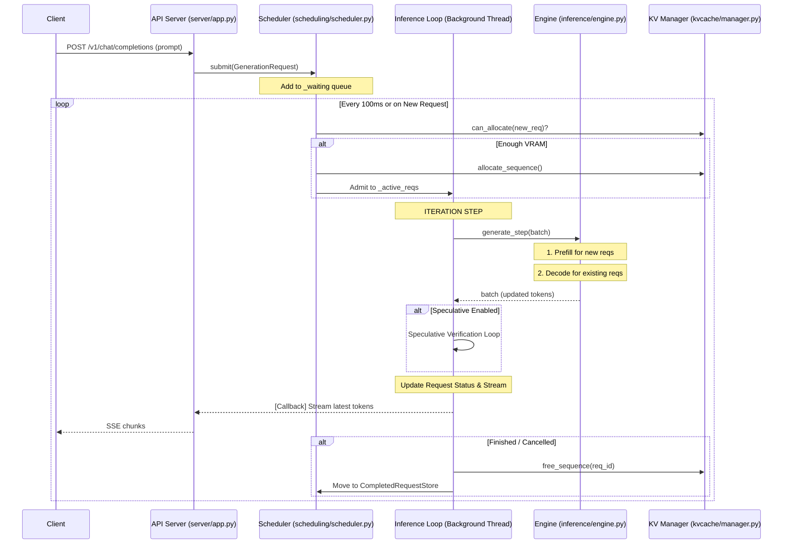
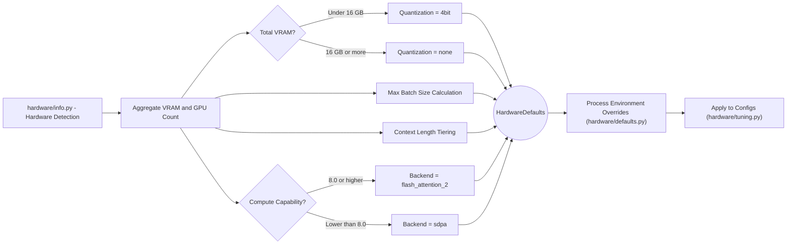
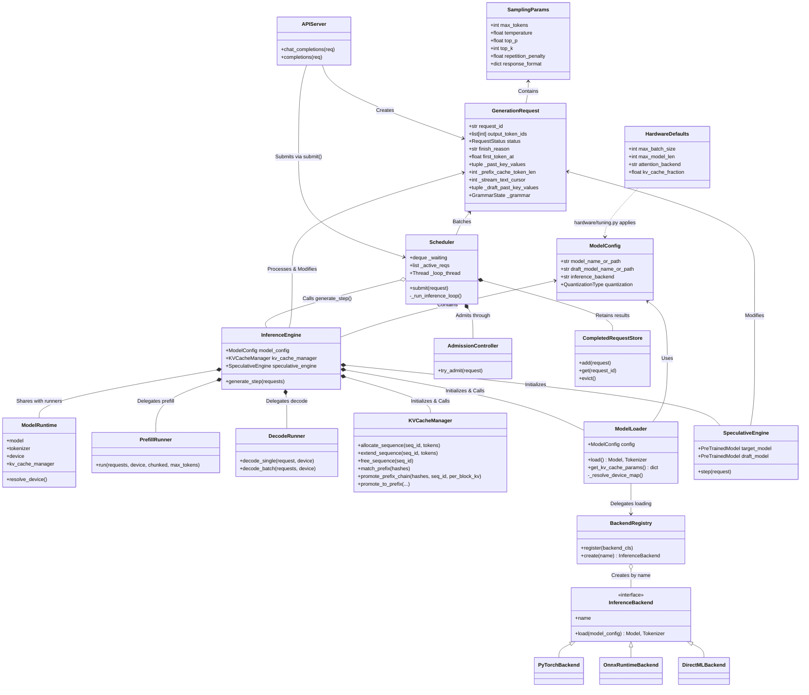

# wLLM Architecture & Design

This document provides a comprehensive, visual guide to the software architecture, design patterns, and internal workflows of the WinLLM inference engine. Built from the ground up in pure Python, it is designed for Windows and inspired by vLLM's memory management principles (though it is not a fork).

> [!NOTE] Table of Contents
> - [1. High-Level System Architecture](#1-high-level-system-architecture)
> - [2. The Request Lifecycle Flow](#2-the-request-lifecycle-flow)
> - [3. Dynamic Memory & Hardware Management](#3-dynamic-memory--hardware-management)
> - [4. Class & Data Flow Diagram](#4-class--data-flow-diagram)
> - [5. Component Deep Dive](#5-component-deep-dive)

See also: [SOLID_Architecture.md](SOLID_Architecture.md) for the package layout and the design principles behind each boundary.

---

## 1. High-Level System Architecture

At its core, WinLLM is divided into three main layers: the API Layer (FastAPI), the Core Engine (Request Scheduling & Memory Management), and the Inference Layer (Multi-Backend Generation Loop).

```mermaid
flowchart TB
    %% Definitions
    Client([API Client / HTTP])
    
    subgraph APILayer ["API Layer Async Thread"]
        Server["server/app.py (FastAPI App)"]
        Router["Endpoints (/v1/chat/completions)"]
        Lifespan["Lifespan Context Manager"]
    end
    
    subgraph CoreEngine ["Core Management Thread (Async)"]
        Schedule["scheduling/ (Scheduler + Admission)"]
        KVManager["kvcache/ (Dynamic VRAM)"]
        Config["config/ (Unified Defaults)"]
    end
    
    subgraph InferenceLayer ["Inference Loop Thread (Background)"]
        Loop["Inference Loop (Continuous Batching)"]
        SpecEngine["inference/speculative.py (Speculative Decoding)"]
        Engine["inference/ (Prefill + Decode Runners)"]
        Backend["backends/ (PyTorch / ONNX / DirectML)"]
        Loader["models/loader.py (Draft Support)"]
        Sample["sampling/ (Logits to Tokens)"]
    end

    subgraph AutoConfig ["Hardware & Model Auto-Tuning"]
        Hardware["hardware/ (Detection + Tuning)"]
        Registry["models/profiles.py (Model Profile)"]
    end
    
    %% Relationships
    Client <-->|REST / SSE Streams| Router
    Server --> Lifespan
    Lifespan -.->|Trigger load/unload| Loader
    
    Router -->|Creates GenerationRequest| Schedule
    Schedule <-->|Checks admission| KVManager
    Schedule -->|Centralized Loop| Loop
    
    Loop -->|Calls generate_step| Engine
    Loop <-->|Verification Loop| SpecEngine
    
    Engine <-->|Computes next token| Sample
    Engine -.->|Claims/Frees Blocks| KVManager
    Engine -.->|Updates Request State| Schedule
    
    Loader -->|Delegates to| Backend
    Backend -->|Returns Model + Tokenizer| Loader

    Hardware -->|Builds Defaults| Config
    Config -->|Applies overrides| Registry
```

---

## 2. The Request Lifecycle Flow

When a user submits a prompt, it travels exactly through this pipeline:

```mermaid
sequenceDiagram
    participant C as Client
    participant A as API Server (server/app.py)
    participant S as Scheduler (scheduling/scheduler.py)
    participant L as Inference Loop (Background Thread)
    participant E as Engine (inference/engine.py)
    participant K as KV Manager (kvcache/manager.py)

    C->>A: POST /v1/chat/completions (prompt)
    A->>S: submit(GenerationRequest)
    Note over S: Add to _waiting queue
    
    loop Every 100ms or on New Request
        S->>K: can_allocate(new_req)?
        alt Enough VRAM
            S->>K: allocate_sequence()
            S->>L: Admit to _active_reqs
        end
        
        Note over L: ITERATION STEP
        L->>E: generate_step(batch)
        Note over E: 1. Prefill for new reqs
        Note over E: 2. Decode for existing reqs
        E-->>L: batch (updated tokens)
        
        alt Speculative Enabled
            L->>L: Speculative Verification Loop
        end
        
        Note over L: Update Request Status & Stream
        L-->>A: [Callback] Stream latest tokens
        A-->>C: SSE chunks
        
        alt Finished / Cancelled
            L->>K: free_sequence(req_id)
            L->>S: Move to CompletedRequestStore
        end
    end
```

---

## 3. Dynamic Memory & Hardware Management

WinLLM handles memory entirely mathematically at runtime, rather than relying on hardcoded rules.

### Hardware Detection Pipeline

```mermaid
flowchart LR
    A["hardware/info.py - Hardware Detection"] --> B["Aggregate VRAM and GPU Count"]
    B --> C{Total VRAM?}
    C -- "Under 16 GB" --> D["Quantization = 4bit"]
    C -- "16 GB or more" --> E["Quantization = none"]
    
    B --> F["Max Batch Size Calculation"]
    B --> G["Context Length Tiering"]
    
    B --> H{Compute Capability?}
    H -- "8.0 or higher" --> I["Backend = flash_attention_2"]
    H -- "Lower than 8.0" --> J["Backend = sdpa"]
    
    D & E & F & G & I & J --> K((HardwareDefaults))
    K --> L["Process Environment Overrides (hardware/defaults.py)"]
    L --> M["Apply to Configs (hardware/tuning.py)"]
```

### The Paged Attention (KV Cache) Simulator

Because pure PyTorch doesn't natively support memory paging like vLLM does, the `kvcache/` package simulates block-level allocation. When the scheduler receives a request, the `KVCacheManager` (composing a `KVMemoryEstimator`, a `BlockAllocator`, and a `PrefixCache`):

1. Uses actual model parameters (`num_layers`, `num_kv_heads`, `head_dim`) to compute precise token byte costs (`kvcache/estimator.py`).
2. Checks remaining available system VRAM via `KVMemoryEstimator.total_available_vram()`.
3. Pre-allocates a percentage (default 90%) into logical blocks of 16 tokens (`kvcache/blocks.py`).
4. Tells the scheduler if there is enough block space to fit the incoming prompt + generation.

---

## 4. Class & Data Flow Diagram

This diagram illustrates how core classes interact, and how data structures (like configs and requests) are passed throughout the system.

```mermaid
classDiagram
    %% Core Data Structures
    class ModelConfig {
        +str model_name_or_path
        +str draft_model_name_or_path
        +str inference_backend
        +QuantizationType quantization
    }
    
    class SamplingParams {
        +int max_tokens
        +float temperature
        +float top_p
        +int top_k
        +float repetition_penalty
        +dict response_format
    }
    
    class GenerationRequest {
        +str request_id
        +list[int] output_token_ids
        +RequestStatus status
        +str finish_reason
        +float first_token_at
        +tuple _past_key_values
        +int _prefix_cache_token_len
        +int _stream_text_cursor
        +tuple _draft_past_key_values
        +GrammarState _grammar
    }

    class HardwareDefaults {
        +int max_batch_size
        +int max_model_len
        +str attention_backend
        +float kv_cache_fraction
    }
    
    %% Core Managers
    class InferenceEngine {
        +ModelConfig model_config
        +KVCacheManager kv_cache_manager
        +SpeculativeEngine speculative_engine
        +generate_step(requests)
    }

    class ModelRuntime {
        +model
        +tokenizer
        +device
        +kv_cache_manager
        +resolve_device()
    }

    class PrefillRunner {
        +run(requests, device, chunked, max_tokens)
    }

    class DecodeRunner {
        +decode_single(request, device)
        +decode_batch(requests, device)
    }
    
    class Scheduler {
        +deque _waiting
        +list _active_reqs
        +Thread _loop_thread
        +submit(request)
        -_run_inference_loop()
    }

    class AdmissionController {
        +try_admit(request)
    }

    class CompletedRequestStore {
        +add(request)
        +get(request_id)
        +evict()
    }
    
    class KVCacheManager {
        +allocate_sequence(seq_id, tokens)
        +extend_sequence(seq_id, tokens)
        +free_sequence(seq_id)
        +match_prefix(hashes)
        +promote_prefix_chain(hashes, seq_id, per_block_kv)
        +promote_to_prefix(...)
    }
    
    class ModelLoader {
        +ModelConfig config
        +load() Model, Tokenizer
        +get_kv_cache_params() dict
        -_resolve_device_map()
    }

    class SpeculativeEngine {
        +PreTrainedModel target_model
        +PreTrainedModel draft_model
        +step(request)
    }
    
    %% Relationships and Data Flow
    ModelConfig <-- InferenceEngine : Contains
    ModelConfig <-- ModelLoader : Uses
    HardwareDefaults ..> ModelConfig : hardware/tuning.py applies
    
    SamplingParams <-- GenerationRequest : Contains
    GenerationRequest <-- Scheduler : Batches
    GenerationRequest <-- InferenceEngine : Processes & Modifies
    GenerationRequest <-- SpeculativeEngine : Modifies
    
    InferenceEngine *-- ModelRuntime : Shares with runners
    InferenceEngine *-- PrefillRunner : Delegates prefill
    InferenceEngine *-- DecodeRunner : Delegates decode
    InferenceEngine *-- KVCacheManager : Initializes & Calls
    InferenceEngine *-- ModelLoader : Initializes & Calls
    InferenceEngine *-- SpeculativeEngine : Initializes
    Scheduler o-- InferenceEngine : Calls generate_step()
    Scheduler *-- AdmissionController : Admits through
    Scheduler *-- CompletedRequestStore : Retains results
    
    class InferenceBackend {
        <<interface>>
        +name
        +load(model_config) Model, Tokenizer
    }

    class BackendRegistry {
        +register(backend_cls)
        +create(name) InferenceBackend
    }

    InferenceBackend <|-- PyTorchBackend
    InferenceBackend <|-- OnnxRuntimeBackend
    InferenceBackend <|-- DirectMLBackend
    BackendRegistry o-- InferenceBackend : Creates by name
    ModelLoader --> BackendRegistry : Delegates loading
    
    %% API entry point
    class APIServer {
        +chat_completions(req)
        +completions(req)
    }
    
    APIServer --> GenerationRequest : Creates
    APIServer --> Scheduler : Submits via submit()
```

---

## 5. Component Deep Dive

### [`server/`](../winllm/server/) | The Gateway
- Emulates standard OpenAI REST API. The wire contract lives in `server/schemas.py`, the FastAPI factory in `server/app.py`, and SSE streaming in `server/streaming.py`.
- Implements FastAPI's modern `@asynccontextmanager` `lifespan` hook. The model is loaded onto the GPU during startup, and gracefully unloaded during shutdown (Ctrl+C).
- Handles streaming by acting as an asynchronous bridge to the synchronous PyTorch loops. Uses `asyncio.Queue` and `loop.call_soon_threadsafe()`.
- Catches GPU timeouts and injects JSON-formatted error chunks securely into the SSE stream.
- **Structured output**: chat completions accept OpenAI-style `response_format` (`json_object` / `json_schema`); the app validates the request shape (400 on bad type or missing xgrammar) and passes it through `SamplingParams` to the sampler's grammar constraint.
- **Real `finish_reason`**: responses (streaming and non-streaming) surface the request's actual finish reason — `stop`, `length`, `cancelled`, or `error` — so clients can detect `max_tokens` truncation.
- **Observability** (`server/metrics.py`): `GET /metrics` renders Prometheus text format (hand-rolled, no prometheus-client dependency) — request/token counters, queue and KV-cache gauges, and p50/p90/p99 summaries for TTFT, end-to-end latency, and per-request throughput. The same percentiles appear in `/health` under `scheduler.stats`.

### [`scheduling/`](../winllm/scheduling/) | The Task Orchestrator
- **Continuous Batching**: The `Scheduler` (`scheduling/scheduler.py`) maintains a background `_loop_thread` that constantly attempts to admit new requests into an active batch.
- **Delegated decisions**: admission ordering is a pluggable `SchedulingPolicy` (`scheduling/policies.py`), memory fit + prefix matching live in the `AdmissionController` (`scheduling/admission.py`), and finished requests are retained by a TTL/count-bounded `CompletedRequestStore` (`scheduling/completed.py`).
- **Async Interface**: Provides `submit()` and `submit_streaming()` as async interfaces, while the actual heavy lifting happens in the background thread.
- **Uniform finish handling**: the loop's finish check covers EOS, `max_tokens`, **stop strings** (decoded incrementally with a per-request cursor, so no O(n²) re-decoding), cancellation, and step failures. Every finish path runs the same cleanup — batch removal, KV free, waiter/stream signalling — and stamps `finish_reason` on the request.
- **Latency stats** (`scheduling/stats.py`): `SchedulerStats` keeps sliding windows of TTFT (queue-inclusive), end-to-end latency, and per-request decode throughput, exposing p50/p90/p99 for `/metrics` and `/health`.

### [`inference/`](../winllm/inference/) | The Batched Inference Engine
- **`InferenceEngine.generate_step()`** (`inference/engine.py`): The primary entry point for inference. It takes a *list* of requests and dispatches one iteration of prefill or decode for all of them.
- **Decomposed internals**: prompt processing lives in `PrefillRunner` (`inference/prefill.py`, including chunked and batched prefill), token-by-token generation in `DecodeRunner` (`inference/decode.py`), and the blocking single-request loop in `BlockingGenerator` (`inference/generation.py`).
- **Shared state**: all runners operate on a `ModelRuntime` (`inference/runtime.py`) holding the model, tokenizer, device, and KV cache manager.
- **Persistent batched decode** (`inference/buffers.py`): `PersistentBatchCache` keeps the batched KV cache across decode steps, repacking only when the resident batch changes and exposing per-request caches as zero-copy views — so a stable batch copies no KV history per step (`DecodeInputBuffer` still backs the single-request hot path). On membership change, surviving rows move via one fused gather+scatter per layer tensor (`refresh()`), and the per-step attention mask is built as a single vectorized comparison.
- **CUDA graph decode** (`inference/cudagraph.py`, opt-in via `--cuda-graphs`): `CUDAGraphDecoder` captures the single-request decode forward in a `torch.cuda.CUDAGraph` over a preallocated `StaticCache`, replaying it with one launch per token to eliminate CPU kernel-launch overhead (~7–8× decode throughput on small models) — no torch.compile/Triton required. Two safety layers: hybrid architectures (conv/SSM `layer_types`, e.g. LFM2) are rejected at construction since `StaticCache` can't serve them, and a load-time `validate()` teacher-forces the same tokens through the graph and eager paths, requiring mutual top-k agreement of the logits at every probe step — catching capture corruption without rejecting benign fp16 near-tie argmax flips. Any failure silently falls back to the normal loop. The decoder is initialized *before* the KV block budget is estimated so its full-context `StaticCache` VRAM is accounted for.
- **Shared eager decode step** (`inference/eager.py`): `eager_decode_step()` is the single implementation of the per-token forward (`token → model(past) → last logits`) used by `DecodeRunner`, `BlockingGenerator`, the suffix-speculation fallback, and both validation probes — so the probes always exercise exactly the production invocation, and hot paths share the static `DecodeInputBuffer`.

### [`sampling/`](../winllm/sampling/) | Logits → Tokens
- **Sampling pipeline** (`sampling/ops.py`, `sampling/sampler.py`): repetition penalty → temperature → top-k → top-p → multinomial, built as composable `LogitsProcessor` steps. The ops follow the WDDM rules from `PERFORMANCE_NOTES.md`: skip decisions are made in Python on the parameter lists, uniform parameters take scalar broadcast paths, and nothing in the per-token path creates a device tensor or performs a GPU boolean check.
- **Fused native sampling kernel** (`sampling/native.py`, built from `native/sampling/`): when the optional `winllm_sampling` extension is installed (`uv pip install ./native/sampling`, needs nvcc + MSVC), `sample_token` runs the whole pipeline in **one CUDA kernel launch** instead of ~15 — the dominant per-token cost under WDDM. Eligibility is decided per call: CUDA logits, uniform sampling params across the batch, and no request generator (the kernel has its own Philox stream, so **seeded requests keep the torch path** and seeded reproducibility is untouched; greedy never draws, so seeded greedy still fuses). Temp-0 output is token-identical to the torch path (penalty values round through the logits dtype). A kernel failure latches the native path off for the process and decode continues on torch. Measured: +13% end-to-end chat throughput at temp 0.7 (see `PERFORMANCE_NOTES.md`).
- **Grammar-constrained decoding** (`sampling/grammar.py`): `GrammarBackend` compiles a JSON grammar or JSON schema with xgrammar (compiled grammars are cached per schema); each request gets a `GrammarState` that masks illegal tokens from the logits every step. The packed token bitmask is applied by the native `winllm_sampling` kernel in one launch when it's built, and otherwise unpacked with plain torch ops — either way it runs on CUDA **without Triton** (which xgrammar's own GPU kernel needs and Windows lacks). Grammar-constrained requests automatically bypass speculative decoding, since draft proposals aren't masked. Optional dependency: `pip install winllm[structured]`.

### [`backends/`](../winllm/backends/) | Multi-Backend Model Loading
- **`BackendRegistry`** (`backends/registry.py`): maps backend names to `InferenceBackend` implementations. New runtimes register a class — no dispatch code changes:
  - **PyTorch** (`backends/pytorch.py`, default): Standard HuggingFace `AutoModelForCausalLM` with quantization and multi-GPU support.
  - **ONNX Runtime** (`backends/onnx.py`): Uses Optimum's `ORTModelForCausalLM` for Windows-native acceleration without Triton/MSVC. Includes smart handling of pre-exported ONNX repositories (e.g., LiquidAI models with `subfolder` and `file_name` routing via the pure `build_ort_kwargs()` function).
  - **DirectML** (`backends/directml.py`): Uses `torch-directml` for cross-vendor GPU acceleration via DX12.
- **Tokenizer Fallback** (`backends/tokenizers.py`): Built-in workaround for the Optimum `TokenizersBackend` bug on ONNX-exported models — automatically falls back to the base model's tokenizer.

### [`inference/speculative.py`](../winllm/inference/speculative.py) | Accelerated Generation
- **Draft Model Logic**: Implements speculative decoding where a smaller model proposes tokens that the larger target model verifies in a single forward pass.
- **Three-phase pipeline**: `_draft_proposals()` generates candidates (capped at the request's remaining `max_tokens` budget), `_verify_proposals()` runs target verification in one pass, and `_accept_or_reject()` handles the acceptance loop.
- **Cache invariant**: both target and draft KV caches are kept at exactly `prompt + output - 1` positions. `_ensure_draft_context()` prefills the draft with prior context (so it never proposes blind), and `_sync_caches()` trims rejected draft positions after every step (via the shared `trim_cache` in `inference/buffers.py`, which handles both transformers `Cache` objects and legacy tuples) — guaranteeing the output is identical to plain target-greedy decoding.

### [`inference/suffix_speculative.py`](../winllm/inference/suffix_speculative.py) | Model-Free Speculation (SuffixDecoding)
- **No draft model**: `SuffixCache` (`inference/suffix_cache.py`) drafts by finding the longest suffix of the committed text that already occurred in the prompt/output (bigram-anchored, backward-extended, most-recent-occurrence tie-break) and proposing the tokens that followed it — speculation length adapts to the evidence (`α·p`, the SuffixDecoding rule from arXiv:2411.04975). Zero extra VRAM; big wins on repetitive, structured, and agentic output. An optional native C++ port (`native/suffix/`, `uv pip install ./native/suffix`) drops in transparently with flat per-step cost regardless of match density; a 400-step randomized parity test keeps it exactly in agreement with the pure-Python implementation (`WINLLM_PURE_PYTHON=1` forces the fallback).
- **Lossless by construction**: committed tokens are always the target's own samples — drafts only decide how many tokens one forward pass commits — so output is token-identical to plain decoding. Steps with no usable match fall back to a plain `eager_decode_step` at zero extra cost. Drafts are capped at the remaining `max_tokens` budget.
- **Rollback soundness probe**: rejection requires cropping the KV cache, and hybrid caches with recurrent state don't rewind (`Lfm2HybridConvCache.crop()` is lossy). At load, `validate()` runs a context → junk → crop → compare probe and only enables the engine when rollback reproduces eager logits; unsound architectures degrade to plain decode with a warning. Opt-in via `--suffix-decoding` / `ModelConfig.enable_suffix_decoding`; a configured draft model takes precedence.

### [`kvcache/`](../winllm/kvcache/) | Logical Memory Tracker
- **Iteration-Level Allocation**: The ref-counted `BlockAllocator` (`kvcache/blocks.py`) tracks block usage across the entire batch; capacity comes from the `KVMemoryEstimator` (`kvcache/estimator.py`).
- **Prefix Caching**: prompt-block hashing, KV carving (`slice_prompt_blocks`), and cached-prefix storage live in `kvcache/prefix.py`. *Every* complete prompt block is promoted as a cumulative chain (not just the first), and `match()` concatenates the longest matching chain so recurring prefixes of any length skip recomputation. The cache is bounded (`prefix_cache_block_fraction` of the KV budget) and uses **leaf-only LRU eviction** — only a prefix with no longer prefix depending on it is reclaimed — so promoted blocks can't permanently starve the live KV cache.
- **Sequence Management**: The `KVCacheManager` facade (`kvcache/manager.py`) provides `allocate_sequence`, `extend_sequence`, and `free_sequence` methods invoked by the scheduler and engine during the generation lifecycle.

### [`cli/`](../winllm/cli/) & [`config/`](../winllm/config/) | Unified Configurations
- `config/` centralizes pure-data dataclasses (`ModelConfig`, `SchedulerConfig`, `KVCacheConfig`, `SamplingParams`), one module per subsystem.
- CLI params naturally cascade into Config objects. The `--auto-config` flag triggers the dynamic hardware discovery sequence; `hardware/tuning.py` overwrites baseline constraints with optimized formulas (configs themselves stay free of service dependencies).

### [`models/profiles.py`](../winllm/models/profiles.py) | Model Introspection
- Examines the HuggingFace repo name (e.g. `meta-llama/Llama-3.1-8B-Instruct`).
- Determines the architectural family (Llama, Gemma, Mistral, Qwen).
- Injects ideal hyper-parameters (e.g. `max_context_window=32768`, `rope_scaling=True`) before the tensors are ever initialized in VRAM.
