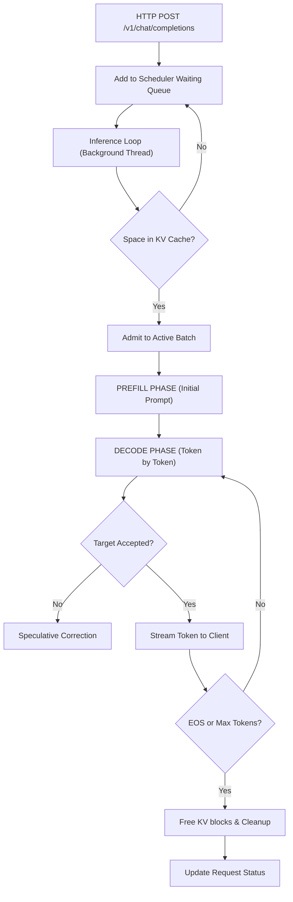
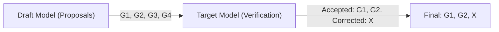

# WinLLM — How LLM Inference Engines Work

This guide teaches you every concept and component behind WinLLM, from first principles.

> [!abstract] Table of Contents
> 1. [[#Chapter 1 How LLMs Generate Text|How LLMs Generate Text]]
> 2. [[#Chapter 2 The KV Cache|The KV Cache]]
> 3. [[#Chapter 3 Token Sampling|Token Sampling]]
> 4. [[#Chapter 4 Model Loading and Quantization|Model Loading & Quantization]]
> 5. [[#Chapter 5 The Request Lifecycle|The Request Lifecycle]]
> 6. [[#Chapter 6 The Scheduler Continuous Batching|The Scheduler (Continuous Batching)]]
> 7. [[#Chapter 7 Performance Optimizations|Performance Optimizations]]
> 8. [[#Chapter 8 Hardware Detection and Scaling|Hardware Detection & Scaling]]
> 9. [[#Chapter 9 Model Registry|Model Registry]]
> 10. [[#Chapter 10 The OpenAI API|The OpenAI API]]
> 11. [[#Chapter 11 WinLLM vs vLLM|WinLLM vs vLLM]]
> 12. [[#Chapter 12 Concept-to-Code Map|Concept-to-Code Map]]

---

## Chapter 1: How LLMs Generate Text

### What happens when you send "Hello" to ChatGPT?

An LLM is a function that takes a sequence of ==tokens== (numbers) and outputs ==probabilities== for what the next token should be. The entire "intelligence" comes from repeating this one step over and over.

```
"Hello, how are" → tokenize → [15496, 11, 703, 527] → model → probabilities for 50,000+ tokens
                                                                 ↓
                                                          " you" (highest prob)
```

The generation loop:

```
Step 1: "Hello"              → model → ","
Step 2: "Hello,"             → model → " how"
Step 3: "Hello, how"         → model → " are"
Step 4: "Hello, how are"     → model → " you"
Step 5: "Hello, how are you" → model → "?"
Step 6: "Hello, how are you?" → model → [EOS]  ← stop!
```

> [!info] Autoregressive Generation
> This is called **autoregressive generation** — each token depends on all previous tokens. The model never "sees" the future, only the past.

### The Two Phases

Every LLM inference has two distinct phases:

> [!tip] Phase 1: Prefill (Prompt Processing)
> - Feed the entire prompt through the model **in one shot**
> - The model processes all tokens in parallel (this is fast!)
> - Result: the first output token + internal state (KV cache)

> [!tip] Phase 2: Decode (Token Generation)
> - Generate **one token at a time**
> - Each step uses the cached state from previous steps
> - This is the bottleneck — it's sequential and memory-bound

**In our code** — `winllm/engine.py` (The Batched Reality):
 
```python
# Instead of a simple loop, we use iteration-level scheduling:
def generate_step(self, requests: list[GenerationRequest]):
    # 1. PREFILL for new requests (batch of prompts)
    # 2. DECODE for existing requests (batch of single tokens)
    
    # Each step computes exactly ONE token for EVERY request in the batch.
    # This allows us to maximize GPU throughput.
```

---

## Chapter 2: The KV Cache

### The Problem

In a transformer, every token needs to "attend" to every previous token. That means computing **Key** and **Value** matrices for every token at every layer.

Without caching: generating token #100 requires recomputing Keys and Values for all 99 previous tokens. Token #101 recomputes all 100. This is ==O(n²)== — disastrously slow.

### The Solution: KV Cache

After you compute Key/Value for a token, **save them**. The next step only needs to compute K/V for the new token and concatenate it to the cache.

```
Step 1: Compute KV for tokens 1-10       → cache = [KV₁, KV₂, ..., KV₁₀]
Step 2: Compute KV for token 11 ONLY     → cache = [KV₁, ..., KV₁₀, KV₁₁]
Step 3: Compute KV for token 12 ONLY     → cache = [KV₁, ..., KV₁₁, KV₁₂]
```

This is what `past_key_values` is in our engine — PyTorch / HuggingFace handle the actual tensors internally.

### The Memory Cost

KV cache is the ==biggest memory hog== after the model weights itself:

$$
\text{Per token} = 2 \times \text{num\_layers} \times \text{num\_kv\_heads} \times \text{head\_dim} \times \text{dtype\_bytes}
$$

> [!example] Example: Mistral-7B
> | Metric | Calculation | Result |
> |--------|-------------|--------|
> | Per token | 2 × 32 × 8 × 128 × 2 | **128 KB** |
> | 4096 tokens | 128 KB × 4096 | **512 MB** (one sequence!) |
> | 8 sequences | 512 MB × 8 | **4 GB** ← half your 8GB GPU! |

> [!important] Why vLLM Invented PagedAttention
> To avoid wasting memory with fragmented allocations. They split the KV cache into small "pages" like an OS manages RAM. This requires custom CUDA kernels.

### Our Approach

We built a **dynamic block manager** in `winllm/kv_cache.py`:

1. Reads the model's actual dimensions after loading
2. Calculates exact per-token memory cost
3. Aggregates total available VRAM across all detected GPUs (`_get_total_available_vram()`)
4. Divides available VRAM into fixed-size blocks (16 tokens each) with dynamic caps (e.g., `max(2048, int(total_vram_gb * 50))`)
5. Tracks allocations per sequence
6. Tells the scheduler "can we afford this new request?"

```python
# After model loads, we read its real architecture:
kv_params = self._loader.get_kv_cache_params()
# → {"num_layers": 32, "num_kv_heads": 8, "head_dim": 128}

# Then calculate precise budget:
per_token = 2 * 32 * 8 * 128 * 2  # = 131,072 bytes per token
per_block = per_token * 16         # = 2 MB per block
available = _get_total_available_vram() * 0.4       # Reserve 40% of remaining VRAM
max_blocks = available / per_block  # How many blocks we can afford dynamically
```

---

## Chapter 3: Token Sampling

The model outputs **logits** — raw scores for every token in the vocabulary (e.g., 32,000 scores). We need to pick ==ONE==. Sampling controls the model's "personality."

### The Pipeline


See `winllm/sampler.py` for the implementation.

### Step 1: Repetition Penalty

Reduce score of tokens already generated, so the model doesn't repeat itself:

```python
# If the model keeps saying "the the the", penalize "the"
# Positive logits → divide by penalty (make less attractive)
# Negative logits → multiply by penalty (make even less attractive)
scores = torch.where(scores > 0, scores / penalty, scores * penalty)
```

### Step 2: Temperature

Controls randomness by scaling the logits before converting to probabilities:

```python
logits = logits / temperature
```

> [!note] Temperature Intuition
> | Value | Effect | Use Case |
> |-------|--------|----------|
> | `0` | Greedy — always pick highest | Factual Q&A |
> | `0.1` | Near-deterministic | Code generation |
> | `0.7` | Balanced (default) | General chat |
> | `1.0` | Natural diversity | Creative writing |
> | `2.0` | Very random | Brainstorming |

Think of it: dividing by a small number makes big scores ==HUGE== relative to small scores → model becomes more "confident." Dividing by a large number flattens the distribution → more random.

### Step 3: Top-K Filtering

Only keep the K highest-scoring tokens, set everything else to `-inf`:

```python
# top_k=50: keep the 50 best candidates
# This prevents sampling from the very low-probability "tail"
top_k_values, _ = torch.topk(logits, top_k)
min_threshold = top_k_values[:, -1]
logits[logits < min_threshold] = -infinity
```

### Step 4: Top-P (Nucleus Sampling)

Keep the smallest set of tokens whose cumulative probability >= P:

```python
# top_p=0.9: keep the tokens that together account for 90% probability
# This ADAPTS to the distribution:
#   - If the model is confident: maybe only 5 tokens pass
#   - If the model is uncertain: maybe 500 tokens pass
```

> [!tip] Why Top-P > Top-K
> Top-p ==adapts== to confidence. When the model is sure about one word, top-k=50 still includes 49 bad options. Top-p=0.9 might only keep 2 tokens.

### Step 5: Sample

```python
probs = F.softmax(logits, dim=-1)     # logits → probabilities (sum to 1.0)
token = torch.multinomial(probs, 1)   # random weighted draw
```

`torch.multinomial` is like a weighted dice roll — tokens with higher probability are more likely to be chosen.

---

## Chapter 4: Model Loading and Quantization

### The VRAM Problem

Your RTX 4070 Mobile has **8 GB VRAM**. Model sizes in float16:

| Model | Parameters | float16 Size | Fits in 8GB? |
|-------|-----------|-------------|-------------|
| Phi-3-mini | 3.8B | 7.6 GB | ⚠️ Barely |
| Mistral-7B | 7B | 14 GB | ❌ |
| Llama-3.1-8B | 8B | 16 GB | ❌ |
| Llama-3.1-70B | 70B | 140 GB | ❌❌❌ |

### Quantization Saves the Day

**4-bit quantization** compresses each weight from 16 bits to 4 bits:

```
Mistral-7B:  7B × 2 bytes = 14 GB   (float16)
             7B × 0.5 bytes = 3.5 GB  (4-bit) ← fits!
```

### NF4 — Not Just "Rounding to 4 Bits"

> [!info] NormalFloat4
> Neural network weights follow a roughly **normal distribution** (bell curve). NF4 creates a 4-bit lookup table optimized for this distribution — so the 16 quantization levels are placed where most weights actually are, not evenly spaced.

```python
BitsAndBytesConfig(
    load_in_4bit=True,
    bnb_4bit_compute_dtype=torch.float16,    # Compute stays in fp16 for accuracy
    bnb_4bit_quant_type="nf4",               # NormalFloat4
    bnb_4bit_use_double_quant=True,          # Also quantize the quantization constants!
)
```

`double_quant=True` saves another ~0.4 GB by quantizing the scaling factors themselves.

### How the Model Gets Distributed

See `winllm/model_loader.py`.

When you call `device_map="auto"`, HuggingFace's `accelerate` library:

1. Creates the model on a "meta" device (uses ==0 bytes==)
2. Measures each layer's actual size
3. Greedily assigns layers: fill GPU₀ → GPU₁ → … → CPU RAM → disk

```python
load_kwargs["device_map"] = "auto"      # Single GPU: everything on cuda:0
load_kwargs["device_map"] = "balanced"  # Multi-GPU: spread evenly
```

For tensor parallelism (splitting individual layers across GPUs):

```python
load_kwargs["tp_plan"] = "auto"  # Shard attention/MLP across GPUs
```

---

## Chapter 5: The Request Lifecycle

### Flow Diagram


    style A fill:#3b82f6,color:#fff
    style G fill:#8b5cf6,color:#fff
    style I fill:#8b5cf6,color:#fff
    style Q fill:#22c55e,color:#fff
    style F fill:#ef4444,color:#fff

### Module Responsibility

| Step | Module |
|------|--------|
| 1–2 | `api_server.py` |
| 3 | `scheduler.py` |
| 4–9 | `engine.py` |
| 5 | `kv_cache.py` |
| 8 | `sampler.py` |
| 10 | `kv_cache.py` |
| 11 | `scheduler.py` |
| 12 | `api_server.py` |

### Streaming — How Tokens Appear One by One

For `"stream": true`, we use a **threadsafe async queue** pattern to correctly bridge the blocking GPU thread and the async FastAPI server:

```
[GPU Thread]                         [Async HTTP Thread]
    │                                       │
    ├── generate token ──→ queue.put() ──→ queue.get()
    │                                       ├──→ SSE event to client
    ├── generate token ──→ queue.put() ──→ queue.get()
    │                                       ├──→ SSE event to client
    └── finished ──────→ queue.put() ──→ queue.get()
                                            └──→ [DONE] event
```

> [!note] Robust Error Handling & Timeouts
> Our streaming implementation catches `asyncio.TimeoutError` if generation stalls, gracefully cancels the generation request, and yields an SSE error block to the client. This prevents hung connections and memory leaks.

### Server Lifecycle
We use FastAPI's robust `@asynccontextmanager` `lifespan` hook to manage the model's memory. When the server starts, we yield to load the model on a background thread. When the server shuts down (e.g. `Ctrl+C`), the hook resumes to gracefully unload the model and free GPU VRAM, completely replacing the deprecated `@app.on_event` handlers.

---

## Chapter 6: The Scheduler (Continuous Batching)
 
### Why Not Just Handle One Request at a Time?
 
Because the GPU is ==underutilized== during decode. Each decode step is **memory-bound** (waiting for data to move between GPU memory and compute cores). The engine spends 90% of its time waiting for weights to load from VRAM rather than doing math.
 
### Our Approach: Iteration-Level Scheduling
 
See `winllm/scheduler.py`. We use a background thread `_run_inference_loop` that treats the model as a giant **state machine**. 
 
> [!info] The Global Loop
> Whereas standard Python servers use many threads, the `InferenceLoop` is a single architectural bottleneck where all GPU operations happen. This avoids race conditions on the CUDA streams.
 
1.  **Waiting Pool**: New requests sit in a `deque`.
2.  **Admission**: Every iteration, the loop checks `kv_cache_manager.can_allocate()`. If yes, it allocates blocks and moves the request to the `_active_reqs` list.
3.  **Execution**: The loop calls `engine.generate_step(active_batch)`. 
    - **Prefill Merge**: New requests are concatenated into a single padded prefill batch.
    - **Decode Merge**: Existing requests are batched into a single 1-token-wide forward pass.
4.  **Streaming**: Tokens are streamed back via thread-safe callbacks (`loop.call_soon_threadsafe`) to the FastAPI front-end.
 
> [!tip] No More Semaphores
> We moved from a simple `Semaphore` (which blocked based on the number of users) to **Dynamic Admission Control**. We admit as many users as the KV cache can literally hold, utilizing 100% of available VRAM.

### Queue Eviction Strategy
To prevent memory leaks from completed requests continuously piling up in memory, the Scheduler runs a periodic eviction pass (`_evict_completed`). It clears out finished requests based on two bounded constraints:
1. **TTL (Time to Live)**: Requests older than `completed_request_ttl` seconds are deleted.
2. **Max Kept Limit**: The dictionary size is hard-capped to `max_completed_requests` to ensure stable memory usage during extended operation.

| Hardware | `max_batch_size` | Why |
|----------|-----------------|-----|
| Laptop (8GB) | 4 | Limited VRAM for KV cache |
| Desktop (24GB) | 8 | More headroom |
| Datacenter (H200) | 64 | Massive VRAM |

> [!warning] How vLLM Does It Differently
> vLLM's **continuous batching** combines multiple sequences into a single GPU kernel call — all sequences are processed together in one matrix multiplication. This is much more efficient but requires custom CUDA kernels. Our approach runs them in separate threads on the same GPU.

---

## Chapter 7: Performance Optimizations

Generating tokens one-by-one is inherently slow. We implement three strategies to cheat the speed limit.

### 1. Graph Compilation (`torch.compile`)
 
Python is slow. When PyTorch runs "eagerly," it must tell the GPU what to do step-by-step. With `torch.compile`, we look at the entire model code and **fuse** operations together into optimized GPU kernels.
 
> [!important] Reduce Overhead
> We use `mode="reduce-overhead"` which caches the GPU's execution plan, virtually eliminating the time the CPU spends managing the GPU. This is critical for 1-token decodes where the overhead often exceeds the math time.
 
### 2. Continuous Batching
 
In standard servers, you wait for Request A to finish 500 tokens before starting Request B. In WinLLM, Request B enters the batch **at the next token iteration**. This is achieved by:
- **Dynamic Masking**: Masking out tokens from Request B while Request A is deep in its decode loop.
- **Iteration Steering**: The scheduler can stop, add, or remove requests from the batch every single token step.

### 3. Speculative Decoding (The Oracle Pattern)
 
We use a tiny **Draft Model** (e.g., Phi-1B) to guess the next 4 tokens. We then send all 4 guesses to the massive **Target Model** (e.g., Llama-70B) in a *single forward pass*.
 
- **The Proposal**: The Draft model is fast enough to generate 4 tokens in ~5ms.
- **The Verification**: The Target model checks the sequence `[Prompt + G1 + G2 + G3 + G4]` in roughly the same time it takes to check `[Prompt]`.
- **The Acceptance**: We compare the Target's hidden states at each position. If Target says `probs(G1)` is high, we keep it and check `G2`.
 


---

## Chapter 8: Hardware Detection and Scaling

### The Scaling Challenge

Hard-coded settings don't scale. We need the engine to **adapt** to hardware. See `winllm/device.py`.

```python
hw = DeviceInfo.detect()
# Queries torch.cuda.get_device_properties() for each GPU
# Returns: name, VRAM, compute capability, platform, CPU RAM
```

### Dynamic Allocation (No Static Profiles)

Instead of classifying hardware into named tiers ("laptop", "desktop", etc.) with fixed lookup tables, we ==calculate every parameter mathematically== from the actual hardware:

```python
# _build_defaults() — all allocation is formula-driven:
defaults = HardwareDefaults(
    default_quantization="4bit" if total_vram_gb < 16 else "none",
    max_batch_size=max(1, int(total_vram_gb / 1.5)),           # Scales continuously
    max_model_len=8192 if total_vram_gb >= 24 else (4096 if total_vram_gb >= 12 else 2048),
    device_map_strategy="balanced" if device_count > 1 else "auto",
    tensor_parallel_size=device_count,                         # Use all GPUs
    gpu_memory_utilization=0.90,
    kv_cache_fraction=0.90,         # Pre-allocate 90% of remaining VRAM to KV pool
    attention_backend="sdpa",       # Default; overridden below if hardware supports it
)
```

> [!tip] Why Continuous Allocation > Named Profiles
> A 12 GB GPU shouldn't behave identically to an 8 GB GPU just because they're both "laptops." With math-based allocation, a 12 GB card gets `batch_size=8` and a 8 GB card gets `batch_size=5` — each scaled to its exact capacity.

### Attention Backend Auto-Detection

The engine automatically selects the fastest attention implementation your GPU supports:

```python
min_compute = min(g.compute_capability for g in info.devices)
if min_compute >= (8, 0):   # Ampere+ (RTX 30xx, A100, etc.)
    defaults.attention_backend = "flash_attention_2"
# Otherwise stays on "sdpa" (PyTorch native scaled dot-product)
```

> [!info] Attention Backends
> | Backend | When | Speed |
> |---------|------|-------|
> | `sdpa` | Default, all GPUs | Baseline |
> | `flash_attention_2` | Compute ≥ 8.0 (Ampere+) | ~2× faster attention |
> | `eager` | Debugging / compatibility | Slowest, most compatible |

### Environment Variable Overrides

Every auto-tuned default can be overridden without touching code:

```bash
set WINLLM_QUANTIZATION=none
set WINLLM_MAX_BATCH_SIZE=16
set WINLLM_ATTENTION_BACKEND=eager
winllm serve -m my-model --auto-config
```

> [!example] All Environment Variables
> | Variable | Controls | Type |
> |----------|----------|------|
> | `WINLLM_QUANTIZATION` | Quantization mode | str |
> | `WINLLM_MAX_BATCH_SIZE` | Max concurrent requests | int |
> | `WINLLM_MAX_MODEL_LEN` | Max context length | int |
> | `WINLLM_DEVICE_MAP` | Device map strategy | str |
> | `WINLLM_TP_SIZE` | Tensor parallel size | int |
> | `WINLLM_GPU_UTILIZATION` | GPU memory utilization | float |
> | `WINLLM_KV_FRACTION` | KV cache VRAM fraction | float |
> | `WINLLM_ATTENTION_BACKEND` | Attention implementation | str |

### Multi-GPU: Two Strategies

> [!note] Device Map (Model Sharding) — Fits Bigger Models
> ```
> GPU 0: layers 0-15    GPU 1: layers 16-31
> Data flows: GPU0 → GPU1 (sequentially, no speedup)
> ```
> Easy to use (`device_map="balanced"`). No speedup per-request, but fits models larger than one GPU.

> [!note] Tensor Parallelism (Layer Splitting) — Actually Faster
> ```
> GPU 0: left half of layer    GPU 1: right half of layer
> Data flows: Both GPUs compute simultaneously, sync after each layer
> ```
> Real speedup (~linear with GPU count). Requires fast GPU interconnect (NVLink). Enabled with `tp_plan="auto"`.

---

## Chapter 9: Model Registry

See `winllm/registry.py`.

### The Problem

Different model families have different optimal settings. Llama-3 supports RoPE scaling for extended context. Mistral handles sliding window attention natively. Gemma is sensitive to quantization. You shouldn't need to know all this — the engine should **just pick the right settings**.

### How It Works

The registry maintains a list of known model families with pre-tuned profiles:

```python
KNOWN_MODELS = [
    ModelProfile(family="llama",   match_keywords=["llama-3", "llama-2", "llama"],
                 max_context_window=8192, rope_scaling=True),
    ModelProfile(family="mistral", match_keywords=["mistral", "mixtral"],
                 max_context_window=32768, rope_scaling=False),
    ModelProfile(family="qwen",    match_keywords=["qwen1.5", "qwen2", "qwen"],
                 max_context_window=32768, rope_scaling=True),
    ModelProfile(family="gemma",   match_keywords=["gemma"],
                 max_context_window=8192, rope_scaling=False),
]
```

When `--auto-config` is used, the pipeline:
1. Detects hardware → `_build_defaults()` calculates base parameters
2. Identifies model family → `identify_model_profile()` matches repo name keywords
3. Applies family tweaks → `apply_model_profile()` adjusts quantization, context window

> [!info] Automatic, Not Mandatory
> If no model is recognized, the engine falls back to generic defaults. For new or custom models, everything still works — you just don't get family-specific optimizations.

---

## Chapter 10: The OpenAI API

### Why Match OpenAI's Format?

See `winllm/api_server.py`.

By implementing the same API shape, **any tool built for OpenAI works with WinLLM**. Just change the base URL:

```python
from openai import OpenAI
client = OpenAI(base_url="http://localhost:8000/v1", api_key="not-needed")
response = client.chat.completions.create(
    model="Phi-3-mini",
    messages=[{"role": "user", "content": "Hello!"}]
)
```

> [!success] Compatible With
> - Python `openai` library
> - LangChain / LlamaIndex
> - Continue (VS Code extension)
> - Any OpenAI-compatible client

### Chat Template — Why It Matters

Different models expect different prompt formats. Llama uses `[INST]` tags, Phi-3 uses `<|system|>` tags, ChatML uses `<|im_start|>`. If you get the format wrong, the model outputs garbage.

```python
# In api_server.py — we don't need to know the format!
prompt = engine.tokenizer.apply_chat_template(
    messages,                        # [{"role": "user", "content": "Hello!"}]
    tokenize=False,                  # Return string, not token IDs
    add_generation_prompt=True,      # Add the "Assistant:" prefix
)
# The tokenizer knows the model's format and does the right thing
```

> [!tip]
> Always use `apply_chat_template()` instead of manually building prompts — it works with any model automatically.

---

## Chapter 11: WinLLM vs vLLM

An honest comparison. Understanding the gap helps you know where to improve.

| Feature | vLLM | WinLLM |
|---------|------|--------|
| **Language** | Python + C++/CUDA kernels | Pure Python |
| **KV Cache** | PagedAttention (custom CUDA) | Logical block tracking |
| **Batching** | Continuous batching (fused kernels) | Iteration-level continuous batching |
| **Speculative** | Yes | Yes (SpeculativeEngine) |
| **Compilation** | No | Yes (`torch.compile`) |
| **Platform** | Linux only | Windows + Linux |
| **Performance** | High-end production | High-performance consumer |

### What Makes vLLM Fast?

1. **PagedAttention kernel** — Custom CUDA kernel reads KV cache from scattered memory "pages." Eliminates fragmentation.
2. **Fused continuous batching** — Packs all active sequences into one padded batch tensor, one GPU kernel for the whole batch.
3. **Custom model implementations** — Reimplements architectures with FlashAttention, fused rotary embeddings, etc.

### Why We Chose This Approach

> [!success] Our Strengths
> - **Simplicity** — ~800 lines of Python vs vLLM's ~100,000+
> - **Compatibility** — Any HuggingFace model works out of the box
> - **Windows native** — No WSL, no Linux-only CUDA extensions
> - **Learning** — You can read and understand every component
> - **80/20 rule** — ~80% of capability with ~5% of complexity

### Where to Go Next

> [!abstract] Future Optimizations
> 1. **FlashAttention** — `pip install flash-attn` → ~2× speedup on attention
> 2. **llama.cpp backend** — GGUF model support for optimized C++ inference
> 3. **TensorRT-LLM** — NVIDIA's production engine, extremely fast
> 4. **True continuous batching** — Fused batch scheduler combining sequences

---

## Chapter 12: Concept-to-Code Map

Quick reference — where each concept lives in the codebase:

### Inference Core

| Concept | File | Key Function |
|---------|------|-------------|
| Autoregressive generation | `engine.py` | `generate_step()` |
| Continuous Batching | `scheduler.py` | `_run_inference_loop()` |
| Speculative Decoding | `speculative.py` | `SpeculativeEngine.step()` |
| Graph Optimization | `engine.py` | `torch.compile(self.model)` |
| Model profile tuning | `registry.py` | `apply_model_profile()` |
| Memory budget | `kv_cache.py` | `allocate_sequence()` |

### Memory Management

| Concept | File | Key Function |
|---------|------|-------------|
| KV memory budget | `kv_cache.py` | `_estimate_max_blocks()` |
| Model-aware KV sizing | `kv_cache.py` | `_estimate_per_token_kv_bytes()` |
| Block allocation | `kv_cache.py` | `allocate_sequence()` |

### Sampling

| Concept | File | Key Function |
|---------|------|-------------|
| Temperature | `sampler.py` | `apply_temperature()` |
| Top-k filtering | `sampler.py` | `apply_top_k()` |
| Top-p / nucleus | `sampler.py` | `apply_top_p()` |
| Repetition penalty | `sampler.py` | `apply_repetition_penalty()` |
| Full pipeline | `sampler.py` | `sample_token()` |

### Model Loading

| Concept | File | Key Function |
|---------|------|-------------|
| 4-bit quantization | `model_loader.py` | `_build_quantization_config()` |
| Model loading | `model_loader.py` | `ModelLoader.load()` |
| Multi-GPU distribution | `model_loader.py` | `_resolve_device_map()` |
| Model introspection | `model_loader.py` | `_extract_model_kv_params()` |

### Scaling & Serving

| Concept | File | Key Function |
|---------|------|-------------|
| Hardware detection | `device.py` | `DeviceInfo.detect()` |
| Dynamic defaults | `device.py` | `_build_defaults()`, `HardwareDefaults` |
| Env overrides | `device.py` | `_apply_env_overrides()` |
| Attention backend | `device.py` | Auto-detect via `compute_capability` |
| GPU memory queries | `device.py` | `get_aggregate_gpu_memory()`, `get_all_gpu_memory_info()` |
| Model registry | `registry.py` | `identify_model_profile()`, `apply_model_profile()` |
| Request scheduling | `scheduler.py` | `Scheduler.submit()` |
| Completed eviction | `scheduler.py` | `_evict_completed()` |
| Concurrency control | `scheduler.py` | `asyncio.Semaphore` |
| OpenAI chat endpoint | `api_server.py` | `chat_completions()` |
| SSE streaming | `api_server.py` | `_stream_response()` |
| CLI commands | `cli.py` | `cmd_serve()`, `cmd_chat()` |
| Configuration | `config.py` | `ModelConfig`, `SamplingParams`, `KVCacheConfig` |
